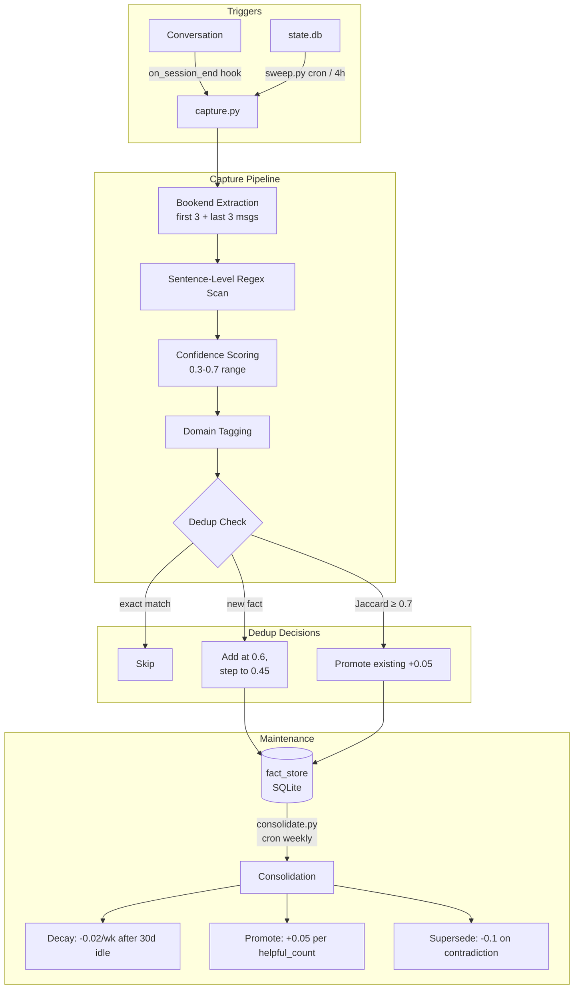

# Hermes Ambient Memory — Architecture

## Overview

Hermes implements a four-layer persistent memory system that sits alongside the LLM's
context window. Layers differ in *when* they're injected (every turn vs. on-demand),
capacity, and retrieval mechanism.

## The Four Layers

| Layer | Store | Injected? | Capacity | Best For |
|-------|-------|-----------|----------|----------|
| KV Memory | `memory` tool | Every turn | 2,200 chars | Essentials: user role, preferences, project paths |
| User Profile | `memory` tool (user) | Every turn | 1,375 chars | Communication style, domain context |
| Fact Store | `fact_store` tool | On-demand only | Unlimited (SQLite) | Deep project knowledge, entity-linked facts |
| Session Search | `session_search` tool | On-demand | Unlimited (FTS5) | Historical verbatim recall |

### Layer 1: KV Memory (`memory` tool)

A key-value store injected into every conversation turn. Keys are short identifiers
(`user_role`, `active_project`, `preferred_language`); values are concise — typically
one or two sentences. The agent reads these at the top of each turn as part of its
system prompt.

- **Budget**: 2,200 characters total across all keys.
- **Persistence**: Written once, updated sparingly. Survives session restarts.
- **Governance**: The agent auto-writes to it. Users can inspect/edit via the `memory`
  tool directly.

### Layer 2: User Profile (`memory` tool, user-scoped)

A second `memory` segment, separate from KV, containing a crafted profile block about
the user. Injected every turn alongside KV memory.

- **Budget**: 1,375 characters.
- **Contents**: Communication preferences, domain expertise, role, tone guidance,
  tool preferences, never-do-this constraints.
- **Maintenance**: Updated manually or by the agent on user request. See
  [maintenance.md](maintenance.md) for audit procedures.

### Layer 3: Fact Store (`fact_store` tool)

A SQLite-backed knowledge graph of *ambiently captured* facts. Each fact is an
`(entity, attribute, value)` triple with associated metadata (trust score, tags,
source session). Queried on-demand — facts are NOT injected into every turn.

- **Storage**: `~/.hermes/profiles/default/memory_store.db`
- **Schema**: `facts` table with entity/attribute/value columns + JSON metadata + FTS5
  virtual table for full-text search.
- **Population**: Via `capture.py`, triggered by:
  1. The `on_session_end` hook after each conversation.
  2. The `sweep.py` cron job (every 4 hours), which scrapes state.db for session
     transcripts that were missed.
- **Retrieval**: Agent calls `fact_store` tool with entity/attribute/tag filters.

### Layer 4: Session Search (`session_search` tool)

Full-text search (SQLite FTS5) over historical session transcripts. Used when the
agent needs to recall *verbatim* what was said — exact code snippets, specific
decisions, error messages.

- **Storage**: Same `memory_store.db`, separate `session_transcripts` table with FTS5
  virtual table.
- **Indexing**: Sessions are chunked (by message) and inserted during capture.
- **Search**: Agent calls `session_search` with natural-language queries. Returns
  ranked snippets with session metadata.

## Data Flow

## Injection Budget Analysis

The KV memory (2,200 chars) + User Profile (1,375 chars) = 3,575 characters injected
per turn. At DeepSeek Flash pricing (~$0.27 per million input tokens):

| Parameter | Value |
|-----------|-------|
| Chars injected per turn | 3,575 |
| Approx tokens (4 chars/token) | ~894 tokens |
| Turns per day (typical) | 20 |
| Tokens per year | 894 × 20 × 365 = 6,526,200 |
| Cost per million input tokens | $0.27 |
| **Annual injection cost** | **~$1.76** |

At 10 turns/day: ~$0.88/year. This is negligible relative to conversation tokens and
buys persistent context across sessions.

## Trade-offs

- **KV memory is always-present but capacity-constrained.** Overstuffing KV memory
  pushes out essential keys. Keep it under 60% utilization (see
  [maintenance.md](maintenance.md)).
- **Fact store is unlimited but on-demand.** The agent must *know to query* it.
  Domain tagging and entity linkage (see [ambient-capture.md](ambient-capture.md))
  are critical for discoverability.
- **Session search is verbatim but noisy.** FTS5 returns raw transcript chunks.
  Semantic filtering is post-hoc; capture.py's domain tags help pre-filter.

## Related Documents

- [Ambient Capture Pipeline](ambient-capture.md) — how facts are extracted
- [Trust Mechanics](trust-mechanics.md) — trust scoring and lifecycle
- [Maintenance Procedures](maintenance.md) — keeping memory healthy
- [SQLite Query Reference](sqlite-queries.md) — direct DB inspection
- [Troubleshooting](troubleshooting.md) — common failure modes
