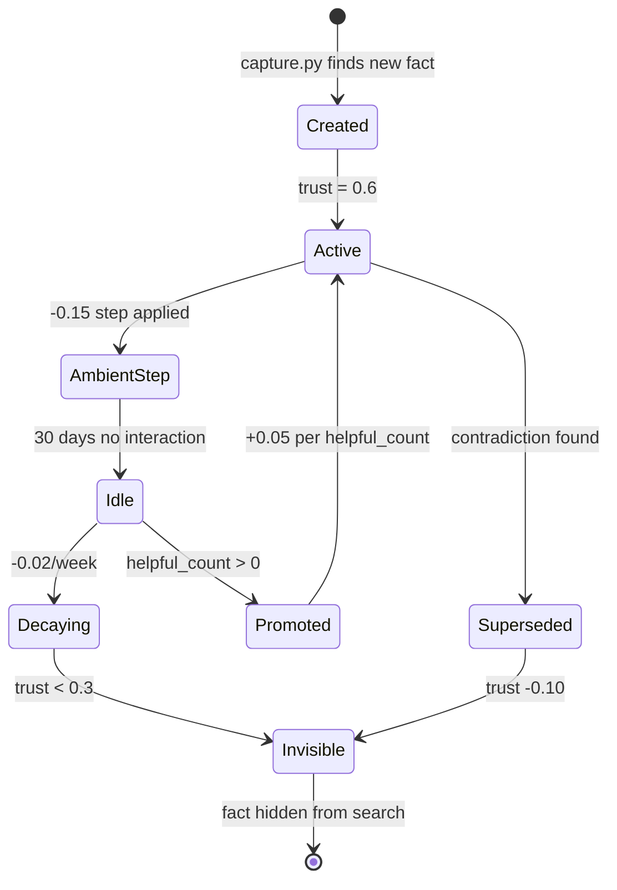

# Trust Mechanics

Every fact in the Hermes fact store carries a **trust score** (0.0–1.0) that governs
its visibility and resilience. The trust system is designed so that ambiently captured
facts gradually lose weight unless reinforced by repeated observation or explicit user
feedback.

## Trust Score Lifecycle

## Trust Operations

### Default Trust on Creation

New facts enter the store at **trust = 0.6**. This is high enough to be visible but
not high enough to compete with explicitly confirmed facts.

### Ambient Step-Down

Immediately after creation, ambient facts (those captured by `capture.py` without
explicit user confirmation) receive a **-0.15 step** to **0.45**. This "ambient
penalty" ensures that:

- Auto-captured facts are visible (above the 0.3 floor) but low-confidence.
- User-confirmed facts (which skip the step) naturally outrank them.
- Repeated observation (dedup promotions) can overcome the penalty.

### Decay

After **30 days without interaction** (no dedup matches, no search hits, no feedback),
a fact begins decaying at **-0.02 per week**.

| Weeks Idle (after 30d) | Trust (from 0.45) | Status |
|------------------------|-------------------|--------|
| 0 | 0.45 | Active |
| 1 | 0.43 | Active |
| 5 | 0.35 | Active |
| 7 | 0.31 | Near floor |
| 8 | 0.29 | **Below 0.3 — invisible** |

**Floor**: Trust never drops below **0.31** from decay alone (the -0.02/week stops at
0.31). However, a *superseded* fact can drop below 0.31.

### Promotion

A fact gains **+0.05 trust** for each `helpful_count` increment. Helpful counts
increase when:

1. **Dedup match** — the same fact is captured again from a different session (see
   [ambient-capture.md](ambient-capture.md) dedup strategy).
2. **Search hit** — the fact is returned by a `fact_store` query and the agent uses it.
3. **Explicit feedback** — the user marks a fact as helpful.

### Feedback

The `fact_store` tool supports feedback flags per fact:

| Feedback | Trust Delta | Effect |
|----------|-------------|--------|
| `helpful` | **+0.05** | Fact was useful; promote it |
| `unhelpful` | **-0.10** | Fact was wrong or misleading; penalize heavily |
| (no feedback) | 0 | No change |

Unhelpful feedback is asymmetrically stronger (-0.10 vs +0.05) because false
information is more harmful than missing information.

### Minimum Trust Threshold

Facts with trust **below 0.3** are invisible to `fact_store` search queries. They
remain in the database but are excluded from results. This threshold prevents stale
or low-confidence facts from polluting retrieval.

To see all facts including sub-threshold ones, use direct SQL queries (see
[sqlite-queries.md](sqlite-queries.md)).

### Supersession

When `consolidate.py` detects contradictory facts about the same entity+attribute,
the **older** fact receives a **-0.10 penalty**. The newer fact is kept (it reflects
more recent information).

Contradiction detection uses:
1. Same `(entity, attribute)` key.
2. Different `value`.
3. Creation timestamps more than 1 hour apart (to avoid penalizing during same-session
   refinement).

## Trust Score Distribution (Typical Healthy State)

| Range | % of Facts | Interpretation |
|-------|-----------|----------------|
| 0.70–1.00 | 5–10% | Highly confirmed facts |
| 0.45–0.69 | 30–40% | Active, reinforced facts |
| 0.31–0.44 | 40–50% | Ambient facts, decaying |
| 0.00–0.30 | 5–10% | Invisible / superseded |

## Related Documents

- [Architecture Overview](architecture.md) — fact store layer
- [Ambient Capture](ambient-capture.md) — how facts enter with initial trust
- [Maintenance](maintenance.md) — consolidating and auditing trust
- [SQLite Queries](sqlite-queries.md) — inspecting trust distribution
